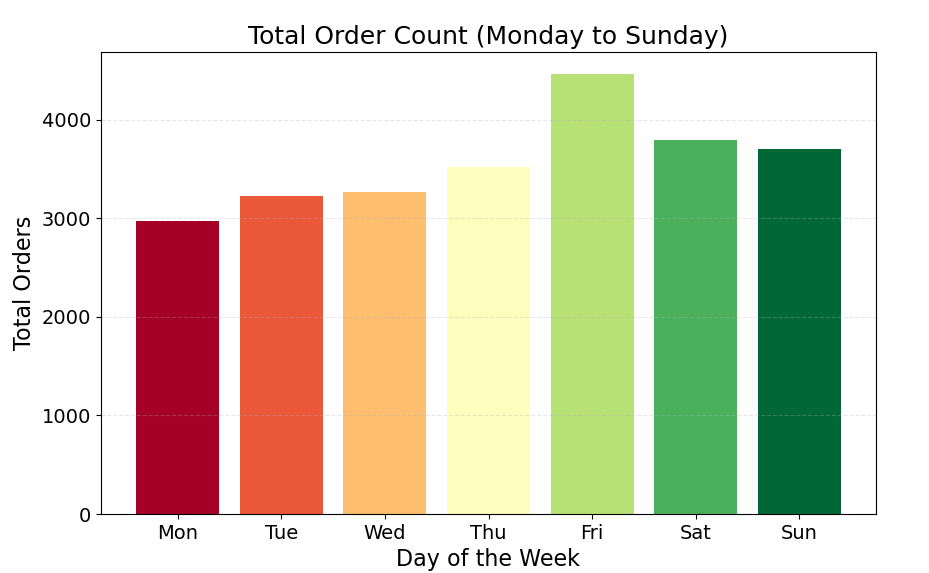
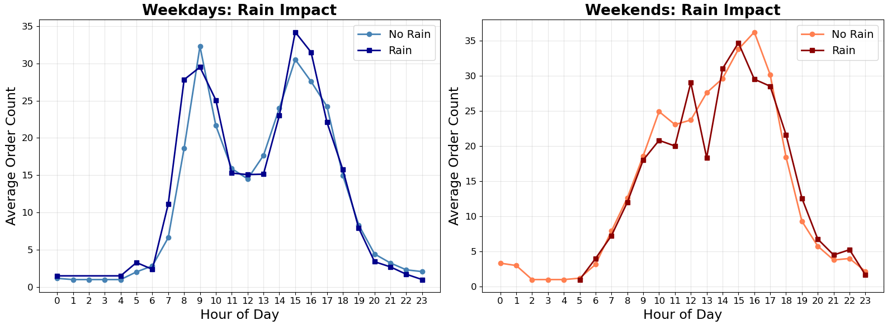
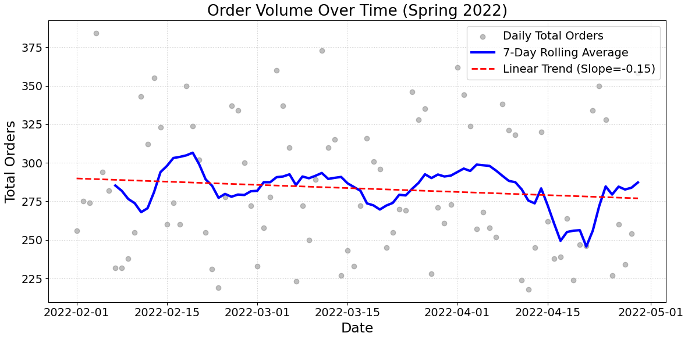
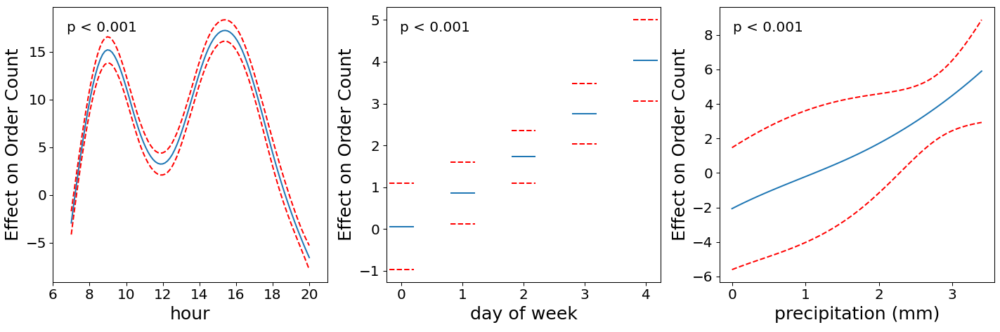
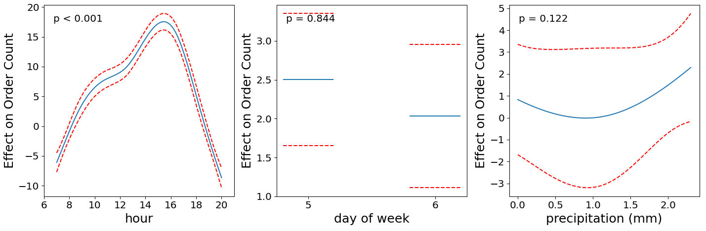

# Delivery Order Forecasting: Hourly Baseline Model

A machine learning system for predicting hourly delivery order volumes to optimize courier supply and maintain consistent service quality across Helsinki.

## 📊 Key Insights

### Order Patterns Throughout the Week


The data reveals distinct weekday vs. weekend patterns, with progressive growth from Monday to Friday and characteristic peak hours at 8-9 AM and 3-4 PM on weekdays.

### Weather Impact on Orders


Precipitation affects order volume on weekdays, with clear positive correlation between rainfall and delivery orders. Weekend patterns require additional data for conclusive analysis.

### Overall Order Volume Trends


Daily order volumes show slight declining trend (slope = -0.15, statistically non-significant), indicating relatively stable demand over the observation period.

### Model Performance: Weekdays


### Model Performance: Weekends


Blue line represents prediction with red, dotted lines 95% confidence interval. In weekday model features `day of week` and `precipitation` predicted orders amount significantly better than in weekend model.

---

## ▶️ Getting Started

### Dependencies and Virtual Environment

```bash
python3 -m venv venv
source venv/bin/activate
pip install -r requirements.txt
```

### How to Run

```bash
python3 data_exploration.py

# Final production model
python3 model.py

# Contains Monte Carlo Cross-Validation run to compare different models
python3 models_comparison.py
```
---

## 📈 Model Performance

### Evaluation Metrics

MAE = Mean Average Error \
RMSE = Root Mean Square Error \
MAPE = Mean Average Percentile Error \
Pseudo R² = Model fit quality (0-1, higher is better)


| Metric | Weekdays | Weekends |
|--------|----------|----------|
| **MAE** | 4.67 orders/hour | 4.70 orders/hour |
| **RMSE** | 6.05 orders/hour | 5.70 orders/hour |
| **MAPE** | 35.95% | 30.20% |
| **Pseudo R²** | 0.68 | 0.76 |

## 🔬 Different Models Performance Comaprison

### Monte Carlo Cross-Validation (30 splits)

GAM with interaction was selected after rigorous comparison against multiple model architectures.

#### Weekday Models (Development: 701 samples | Test: 176 samples)

| Model | Mean MAE | Mean RMSE | Test MAE | Test RMSE |
|-------|----------|-----------|----------|-----------|
| **GAM (with interaction)** ⭐ | **4.93**| **6.43** | **4.67** | **6.05** |
| XGBoost | 4.86 | 6.46 | 4.63 | 6.00 |
| Linear Regression | 4.99 | 6.42 | 4.50 | 6.05 |
| Random Forest | 5.06 | 6.76 | 4.89 | 6.43 |
| GAM (additive) | 5.11 | 6.59 | 4.55 | 6.10 |
| Poisson | 6.17 | 7.76 | 5.77 | 7.32 |
| Dummy (Mean) | 8.58 | 10.67 | 8.50 | 10.46 |

#### Weekend Models (Development: 246 samples | Test: 62 samples)

| Model | Mean MAE | Mean RMSE | Test MAE | Test RMSE |
|-------|----------|-----------|----------|-----------|
| **GAM (with interaction)** ⭐ | **4.18** | **5.35** | **4.70** | **5.70** |
| GAM (additive) | 4.43 | 5.58 | 4.75 | 5.80 |
| XGBoost | 4.41 | 5.59 | 4.79 | 6.13 |
| Random Forest | 4.43 | 5.69 | 4.80 | 6.12 |
| Linear Regression | 4.57 | 5.70 | 4.59 | 5.76 |
| Poisson | 6.02 | 7.34 | 6.24 | 7.37 |
| Dummy (Mean) | 8.63 | 10.45 | 9.46 | 10.97 |
